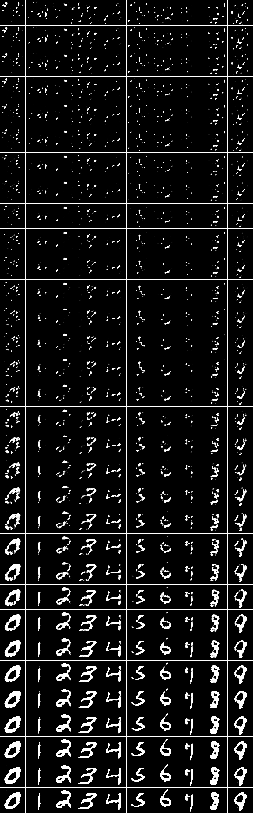
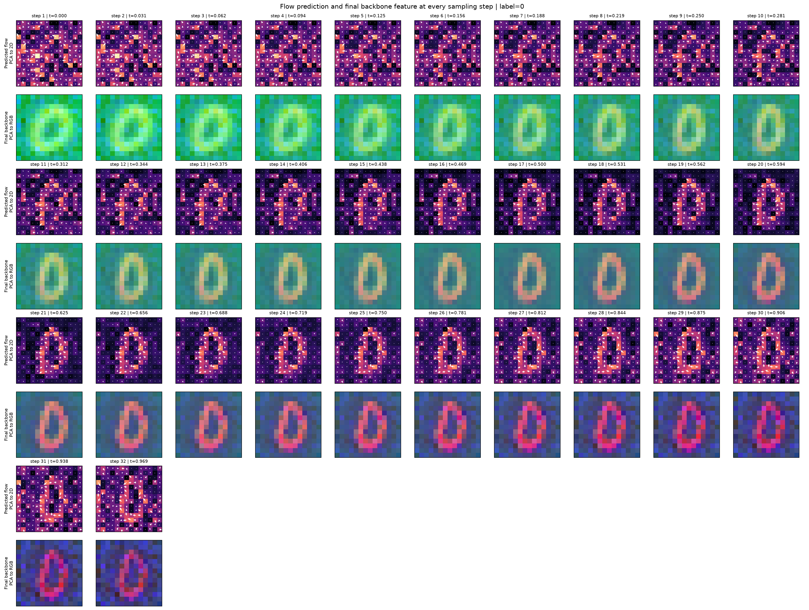
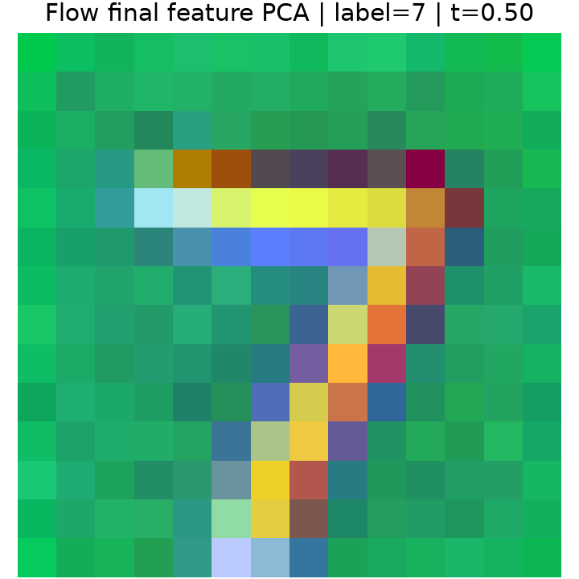
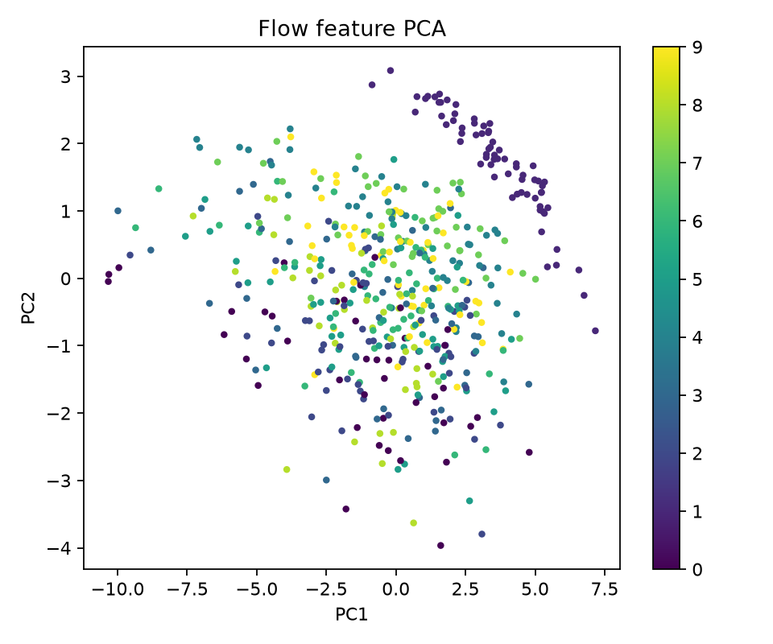
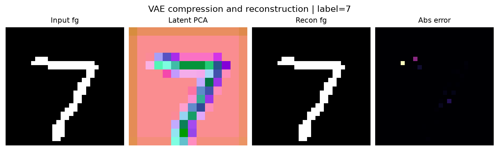
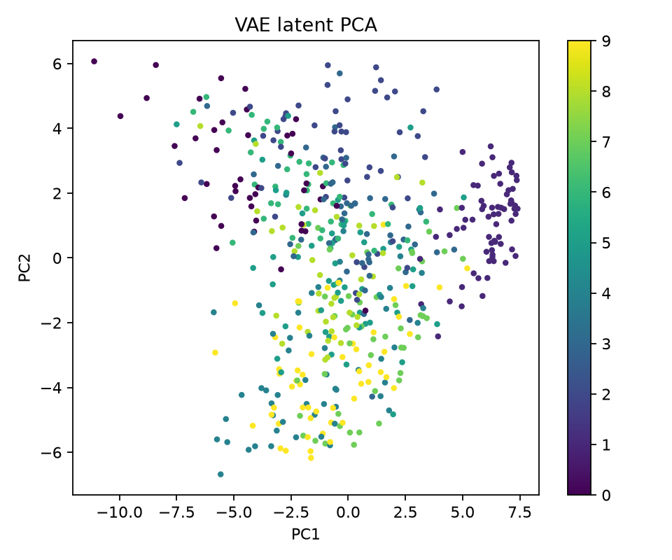
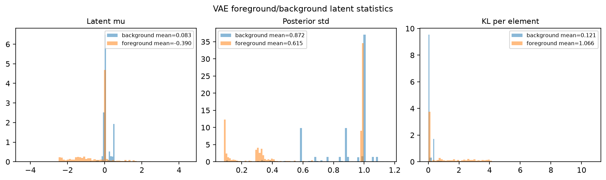
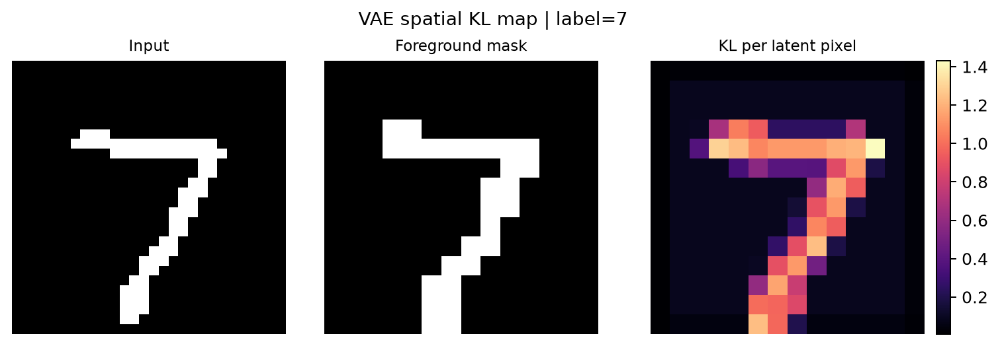
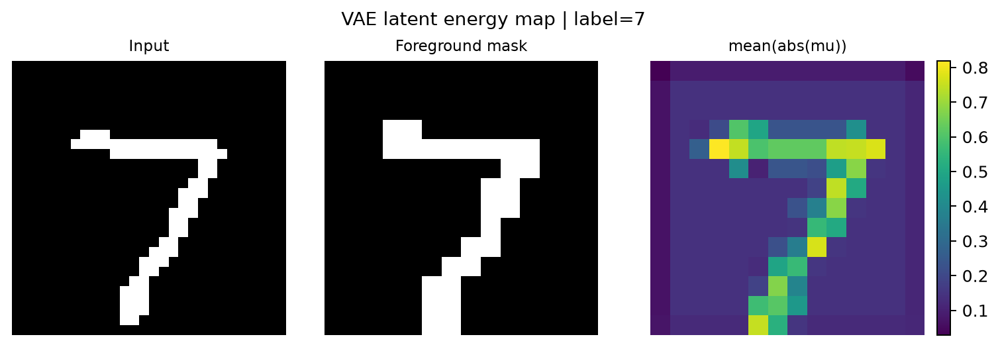
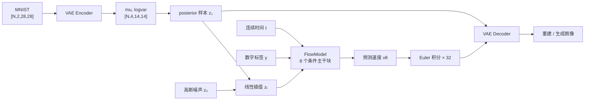

# NumberGenerate

<p align="center">
  <strong>在 VAE 潜空间中，用数字条件 Flow Matching 生成 MNIST 手写数字。</strong>
</p>

<p align="center">
  <a href="https://github.com/1os3/NumberGenerate/releases/tag/Model">预训练权重</a>
  ·
  <a href="#快速开始">快速开始</a>
  ·
  <a href="#可视化结果">可视化结果</a>
  ·
  <a href="#模型原理">模型原理</a>
</p>

NumberGenerate 是一个面向学习与实验的生成模型项目。它先用无条件 VAE 把二值 MNIST 压缩到潜空间，再训练带时间条件和数字标签条件的 Flow Matching 模型，最后通过 Euler 积分把高斯噪声变成指定数字。

```text
MNIST [N,2,28,28]
    -> VAE Encoder
    -> latent [N,4,14,14]
    -> conditional Flow Matching
    -> VAE Decoder
    -> generated image [N,2,28,28]
```

<p align="center">
  <a href="assets/readme/generation_steps.png">
    
  </a>
  <br>
  <sub>每列对应数字 0–9；从上到下是 32 个 Euler 采样步骤。点击查看原图。</sub>
</p>

## 项目特点

- 完整但紧凑：数据、模型、训练、采样、可视化和测试相互分离。
- 潜空间生成：Flow 只在 `4 × 14 × 14` 的 VAE 潜变量上学习速度场。
- 数字可控：时间嵌入与数字标签嵌入共同调制 8 个条件 ConvNeXt 块。
- 可解释：内置生成轨迹、逐步流场、特征 PCA、VAE 重建、KL 与能量热力图。
- 配置集中：默认参数统一放在 `config/default.yaml`，也支持 YAML 覆盖配置。
- 可恢复训练：已有 checkpoint 时会恢复模型、优化器、epoch、step 和 loss。

## 快速开始

### 1. 安装环境

项目已在 Python 3.12 下验证。CPU 可以运行测试、推理和小规模训练，完整训练建议使用 CUDA。

Windows PowerShell：

```powershell
git clone https://github.com/1os3/NumberGenerate.git
cd NumberGenerate
python -m venv .venv
.\.venv\Scripts\python.exe -m pip install -r requirements.txt
```

Linux / macOS：

```bash
git clone https://github.com/1os3/NumberGenerate.git
cd NumberGenerate
python3 -m venv .venv
./.venv/bin/python -m pip install -r requirements.txt
```

主要依赖包括 PyTorch、torchvision、NumPy、PyYAML、Matplotlib、scikit-learn 和 tqdm。

### 2. 下载预训练权重

预训练权重发布在 [Model Release](https://github.com/1os3/NumberGenerate/releases/tag/Model)：

| 文件 | 用途 | 直接下载 |
| --- | --- | --- |
| `vae.pt` | VAE 编码器与解码器 | [下载 vae.pt](https://github.com/1os3/NumberGenerate/releases/download/Model/vae.pt) |
| `flow.pt` | 数字条件 Flow Matching 模型 | [下载 flow.pt](https://github.com/1os3/NumberGenerate/releases/download/Model/flow.pt) |

下载后放到项目根目录的 `ckpt/`：

```text
NumberGenerate/
└── ckpt/
    ├── vae.pt
    └── flow.pt
```

也可以在 Windows PowerShell 中直接下载：

```powershell
New-Item -ItemType Directory -Force ckpt | Out-Null
Invoke-WebRequest `
  -Uri "https://github.com/1os3/NumberGenerate/releases/download/Model/vae.pt" `
  -OutFile "ckpt/vae.pt"
Invoke-WebRequest `
  -Uri "https://github.com/1os3/NumberGenerate/releases/download/Model/flow.pt" `
  -OutFile "ckpt/flow.pt"
```

### 3. 一键生成全部可视化

Windows：

```powershell
.\.venv\Scripts\python.exe -m vis.visualize
```

Linux / macOS：

```bash
./.venv/bin/python -m vis.visualize
```

首次运行会按需把 MNIST 下载到 `datasets/`。脚本读取两个 checkpoint，并把 9 张结果图写入 `outputs/`：

```text
outputs/
├── generation_steps.png
├── flow_prediction_steps.png
├── flow_feature_pca_map.png
├── flow_feature_pca.png
├── vae_reconstruction.png
├── vae_latent_pca.png
├── vae_latent_distribution.png
├── vae_kl_map.png
└── vae_latent_energy_map.png
```

如果只下载了 `vae.pt`，可以只生成 VAE 可视化：

```powershell
.\.venv\Scripts\python.exe -m vis.visualize --mode vae
```

`--only-vae` 与 `--mode vae` 等价。

## 可视化结果

下面的图片是项目输出的可提交快照；重新运行 `vis.visualize` 会在 `outputs/` 中生成新的随机样本。

### 从噪声到数字

`generation_steps.png` 把 0–9 各生成一个样本，并记录全部 32 个历史帧。最开始是潜空间高斯噪声，随后轮廓逐渐聚合，最后由 VAE Decoder 还原为清晰的前景概率图。

<p align="center">
  <a href="assets/readme/generation_steps.png">
    
  </a>
</p>

### Flow 每一步在预测什么

`flow_prediction_steps.png` 跟踪 `visual.flow_step_label` 指定的数字。每个步骤上方是潜空间预测速度经共享 PCA 投影后的二维流场，下方是最后一个 Flow 主干块的特征经共享 PCA 投影后的 RGB 图。共享投影、色阶与流场幅值范围让不同步骤可以直接比较。

[](assets/readme/flow_prediction_steps.png)

| 单样本末端特征 PCA 图 | 测试集末端特征 PCA 分布 |
| --- | --- |
| [](assets/readme/flow_feature_pca_map.png) | [](assets/readme/flow_feature_pca.png) |

- `flow_feature_pca_map.png`：在 `visual.feature_map_time` 指定的时间点，把单个样本的末端特征压到 3 个 PCA 通道并映射为 RGB。
- `flow_feature_pca.png`：把测试集样本的末端特征压到二维，颜色对应数字标签，用来观察条件特征的几何结构。

### VAE 压缩与重建

`vae_reconstruction.png` 依次展示输入前景、潜变量 PCA 图、重建前景和绝对误差。VAE 本身不接收数字标签，只负责学习稳定的图像压缩与重建。

[](assets/readme/vae_reconstruction.png)

| VAE 潜空间 PCA | 前景 / 背景潜变量统计 |
| --- | --- |
| [](assets/readme/vae_latent_pca.png) | [](assets/readme/vae_latent_distribution.png) |

VAE 是无条件模型，因此 PCA 中不同数字发生混合并不意外；这里更关注潜空间是否连续、数值是否稳定，以及前景和背景位置是否呈现不同统计特征。

### 信息集中在哪里

| 空间 KL 强度 | 潜变量能量 `mean(abs(mu))` |
| --- | --- |
| [](assets/readme/vae_kl_map.png) | [](assets/readme/vae_latent_energy_map.png) |

两张热力图先把输入前景下采样到 `14 × 14`，再与潜空间位置对齐：

- KL 图显示每个位置偏离标准高斯先验的强度。
- 能量图显示各位置 `mu` 的平均绝对值。
- 二者与笔画区域的对应关系可以帮助判断 VAE 是否把容量用在有效结构上。

## 模型原理

### 总体流程



训练分为两个阶段：先训练 VAE，再冻结 VAE 训练 Flow。采样时不需要输入真实图片，只需要高斯噪声和目标数字标签。

### 数据表示

MNIST 灰度图先按 `data.binarize_threshold` 二值化，再转换为二通道 one-hot 概率图：

| 张量 | 形状 | 含义 |
| --- | --- | --- |
| `images` | `[N,2,28,28]` | 第 0 通道为 background，第 1 通道为 foreground |
| `labels` | `[N]` | 数字标签，取值 0–9；只传给 Flow |

把背景显式表示为一个通道，可以让 VAE 同时重建“有笔画”和“无笔画”的概率，而不是把背景当成缺失值。

### VAE

Encoder 的主要形状变化：

```text
[N,2,28,28]
  -> 1×1 Conv + ResidualBlock
  -> 2×2 stride-2 Conv + LayerNorm2d
  -> mu, logvar: [N,4,14,14]
```

Decoder 使用残差块、`1×1 Conv` 和 `PixelShuffle(2)` 回到 `[N,2,28,28]`。训练损失为二通道 BCE 与 KL 正则之和；两项都先逐元素求和，再对 batch 取均值：

```text
L_vae = BCEWithLogits(recon, x) + beta * KL(q(z|x) || N(0,I))
beta  = train.vae_kl_weight = 0.05
```

### 条件 Flow Matching

时间 `t` 先编码为 16 组 sin/cos 特征，再经 MLP 映射到 128 维；数字标签也映射到 128 维。二者相加后，通过 `AdaLN2d` 调制 8 个条件 ConvNeXt 主干块。

```text
z_t: [N,4,14,14]
  -> 1×1 Conv, 4 -> 256
  -> 8 × ConditionalDepthwiseSeparableBlock
  -> LayerNorm2d
  -> 1×1 Conv, 256 -> 4
  -> velocity: [N,4,14,14]
```

Flow 训练使用 VAE posterior 样本作为数据端：

```text
z₁ = mu + eps_post * exp(0.5 * logvar)
z₀ ~ N(0,I)
t  ~ Uniform(0,1)
zₜ = (1-t) * z₀ + t * z₁
target_velocity = z₁ - z₀
L_flow = MSE(FlowModel(zₜ, t, label), target_velocity)
```

这里的噪声全部发生在潜空间中，并没有直接给 MNIST 像素加噪。推理时从新的 `z₀` 出发，用默认 32 个 Euler 步骤积分速度场，再交给 VAE Decoder。

## 从头训练

训练 VAE：

```powershell
.\.venv\Scripts\python.exe -m train.vae_trainer
```

输出 checkpoint：

```text
ckpt/vae.pt
```

VAE 训练完成后再训练 Flow：

```powershell
.\.venv\Scripts\python.exe -m train.flow_trainer
```

输出 checkpoint：

```text
ckpt/flow.pt
```

两个训练入口都支持覆盖配置：

```powershell
.\.venv\Scripts\python.exe -m train.vae_trainer --config path/to/override.yaml
.\.venv\Scripts\python.exe -m train.flow_trainer --config path/to/override.yaml
```

覆盖文件只需要写要修改的字段。例如快速检查配置可以写成：

```yaml
data:
  batch_size: 16
  num_workers: 0
train:
  device: cpu
  vae_epochs: 1
  flow_epochs: 1
  max_train_steps: 5
```

如果目标 checkpoint 已存在，训练器会从下一轮 epoch 继续训练。若要从头开始，请先把旧 checkpoint 改名或移出 `ckpt/`。

## 关键默认配置

完整配置与中文注释放在 `config/default.yaml`。

| 配置 | 默认值 | 说明 |
| --- | ---: | --- |
| `data.batch_size` | `128` | DataLoader batch size |
| `data.binarize_threshold` | `0.5` | MNIST 二值化阈值 |
| `train.device` | `auto` | 自动选择 CUDA 或 CPU |
| `train.vae_epochs` | `400` | VAE 训练轮数 |
| `train.flow_epochs` | `200` | Flow 训练轮数 |
| `train.vae_kl_weight` | `0.05` | β-VAE 的 KL 权重 |
| `model.latent_channels` | `4` | VAE 潜变量与 Flow 输入 / 输出通道数 |
| `model.latent_size` | `14` | 潜空间边长 |
| `model.flow_hidden_channels` | `256` | Flow 主干宽度 |
| `model.flow_depth` | `8` | 条件主干块数量 |
| `model.condition_dim` | `128` | 时间 / 标签条件维度 |
| `sample.sampling_steps` | `32` | Euler 更新步数 |
| `sample.history_steps` | `32` | 生成轨迹保存帧数 |
| `visual.pca_samples` | `512` | PCA 最多使用的测试样本数 |

所有默认运行产物都写在项目目录内：数据在 `datasets/`，权重在 `ckpt/`，可视化在 `outputs/`，日志在 `logs/`。

## 代码结构

```text
NumberGenerate/
├── assets/readme/       README 使用的可视化快照
├── config/              配置加载、类型定义和默认参数
├── data/                MNIST 数据集与 DataLoader
├── model/               LayerNorm2d、AdaLN2d、VAE、FlowModel
├── train/               VAE / Flow 训练、checkpoint 与采样
├── vis/                 生成轨迹、PCA 与空间诊断图
├── tests/               配置、形状、损失和条件注入测试
├── debug/               Flow 诊断脚本
├── Doc/                 开发规范与代码索引
├── datasets/            运行时下载的数据，默认被 Git 忽略
├── ckpt/                训练权重，默认被 Git 忽略
├── outputs/             运行时可视化结果，默认被 Git 忽略
└── logs/                训练日志，默认被 Git 忽略
```

推荐阅读顺序：

1. `config/default.yaml`
2. `data/mnist.py`
3. `model/layers.py`
4. `model/vae.py`
5. `model/flow.py`
6. `train/vae_trainer.py` 与 `train/flow_trainer.py`
7. `train/sampling.py` 与 `vis/plots.py`

## 测试

运行全部单元测试：

```powershell
.\.venv\Scripts\python.exe -m unittest discover -s tests
```

运行语法编译检查：

```powershell
.\.venv\Scripts\python.exe -m compileall -q config data model train vis tests
```

测试覆盖配置加载、VAE 与 Flow 张量形状、条件注入、损失反向传播、checkpoint、逐步采样轨迹以及可视化入口检查。

## License

本项目采用 [Apache License 2.0](LICENSE)。
